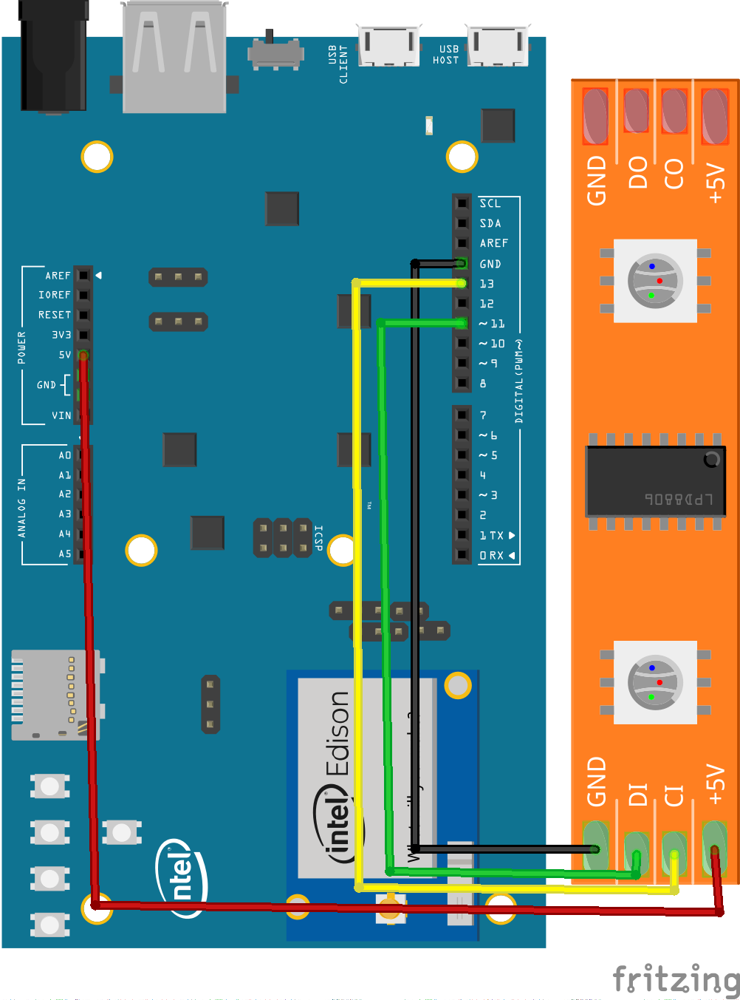
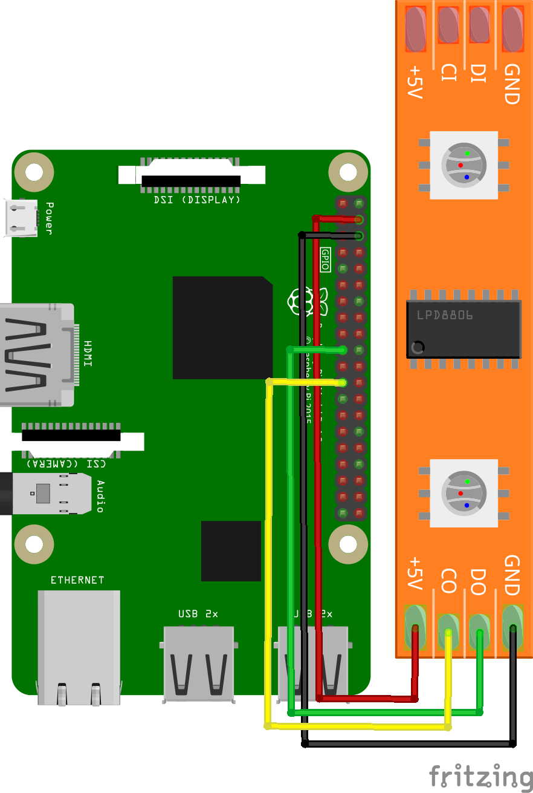

RGB LED strip (APA102) sample for Android Things
================================================

This Android Things sample demonstrates how to interface with a basic 
RGB led strip using the APA102 over SPI protocol.


Pre-requisites
--------------

- Android Things compatible board
- Android Studio 2.2+
- 1 [apa102 compatible RGB Led strip](https://www.adafruit.com/product/2241)


Schematics
----------




The 5v and GND from the Edison and Raspberry Pi 3 are sufficient for driving a few LEDs,
connect these pins to the power pins on the APA102 connector.

Build and install
=================

On Android Studio, click on the "Run" button.

If you prefer to run on the command line, type

```bash
./gradlew installDebug
adb shell am start com.example.androidthings.driversamples/.MainActivity
```

Press the RM onboard button on the Edison. 
When you press the button, the logs will indicate that
the button was pressed and will then blink the LEDs in various patterns.


Troubleshooting
=================

For a strip with more than a few LEDs, use an external power adapter for your
Intel Edison, or power the LED strip from an external power source.


License
-------

Copyright 2016 The Android Open Source Project, Inc.

Licensed to the Apache Software Foundation (ASF) under one or more contributor
license agreements.  See the NOTICE file distributed with this work for
additional information regarding copyright ownership.  The ASF licenses this
file to you under the Apache License, Version 2.0 (the "License"); you may not
use this file except in compliance with the License.  You may obtain a copy of
the License at

  http://www.apache.org/licenses/LICENSE-2.0

  Unless required by applicable law or agreed to in writing, software
  distributed under the License is distributed on an "AS IS" BASIS, WITHOUT
  WARRANTIES OR CONDITIONS OF ANY KIND, either express or implied.  See the
  License for the specific language governing permissions and limitations under
  the License.
